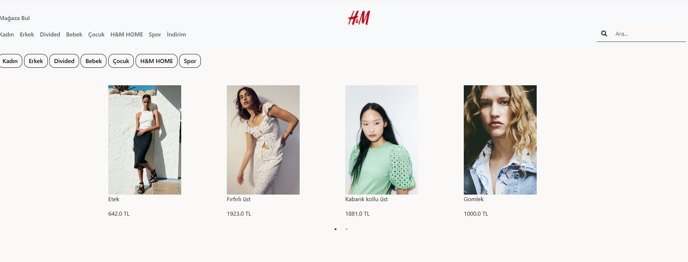

# E-Commerce Fashion Website Project (Midterm Project)

This project aims to create a slimmed-down e-commerce fashion website similar to HM.com. It will be developed using Flask framework and hosted on a cloud provider.

## Project Features

### Home Screen
The home page will display at least 16 new products (4 in each slide). Categories of new products will be displayed dynamically above the slider and will show all new products in the selected category.
- 
### Search Results Screen
Search results for free text will display categories and counts in the left panel and the results in the right panel. Results can be ordered by price ascending or descending and filtered by size. No action is needed for the favorite icon.
- 
### Detail Screen
The detail page will include attributes such as ad number, description, image (at least 1), and category.
- 
### Used in this project:
- Python Flask
- Jinja2
- MySQL
- SqlAlchemy

### Assumptions:
- The functionality of the buttons in the navbar has been disregarded.
- Clicking on the category buttons on the MainPage opens the corresponding slide.
- Case sensitivity has been ignored in the search process.
- When designing the database, it was envisaged that each product could have multiple colors, sizes, categories, and images, but during implementation, it was assumed that each product could have a maximum of 2 colors, a maximum of 5 sizes (s, m, l, xl, xxl), 2 and 4 images per product (2 images per color), and each product would have only one category. The reason for these assumptions is to be able to provide more features with fewer queries in operations such as filtering and sorting in future developments.

### Features:
- When the user opens the homepage, they can see the new products slide.
- The user can perform searches. If the search text is empty, it lists all products.
- The user can sort by price.
- The user can filter by size. [opt: S,M,L,XL,XXL]
- When the user performs a search, on the sidebar on the left, they can see how many products are in each category according to the keyword they entered, and can click to go to the relevant page.

### Data Model:
- 

### Deployment:
**Python Anywhere:** https://nuricanozturk.pythonanywhere.com/
